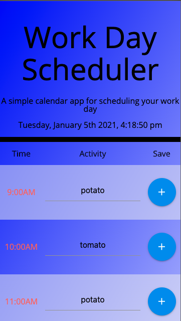
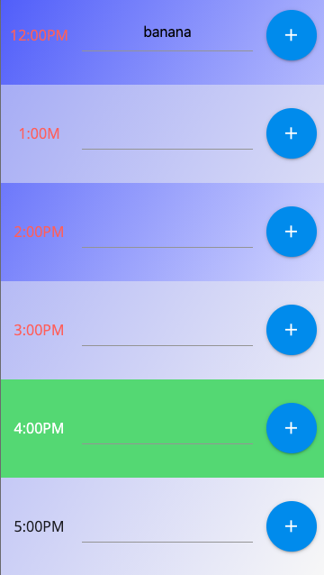

# Work Day Scheduler

A callendar application to help plan a busy 8 hour work day. Broken up into 1 hour blocks, time slots dynamically update HTML and CSS based on time to indicate past, present and future events. 

## User Story

```
AS AN employee with a busy schedule
I WANT to add important events to a daily planner
SO THAT I can manage my time effectively
```

## [Check it Out](https://eamon02.github.io/Responsive-Work-Day-Scheduler/)



## Sources & Contributors 

Big thanks to [Jeff Woda](https://github.com/wodaje), couldn't have gotten so far with JS without him. 

Youtube:
[dcode](https://www.youtube.com/watch?v=fB9KRePY9-w&list=PLVvjrrRCBy2LWFkR7opQxWp4z0en6OHgw&index=3)

## Built With

* [jQuery](https://jquery.com/) - Front-end framework 
* [Materialie](https://materializecss.com/about.html) - CSS framework
* [Moment.js](https://momentjs.com/) - javaScript library 
